<div style="text-align: justify">

# Music Collection

<table>

<tr>
<td>

## Learn detailed information about the music you love !

Music Collection is a mobile application that allows users to store and manage their favorite albums. The application integrates with [Last.fm API](https://www.last.fm/api) to provide users with in-depth information about the albums themselves, the artists behind them and the track listing for a complete music listening experience.

</td>
<td>
  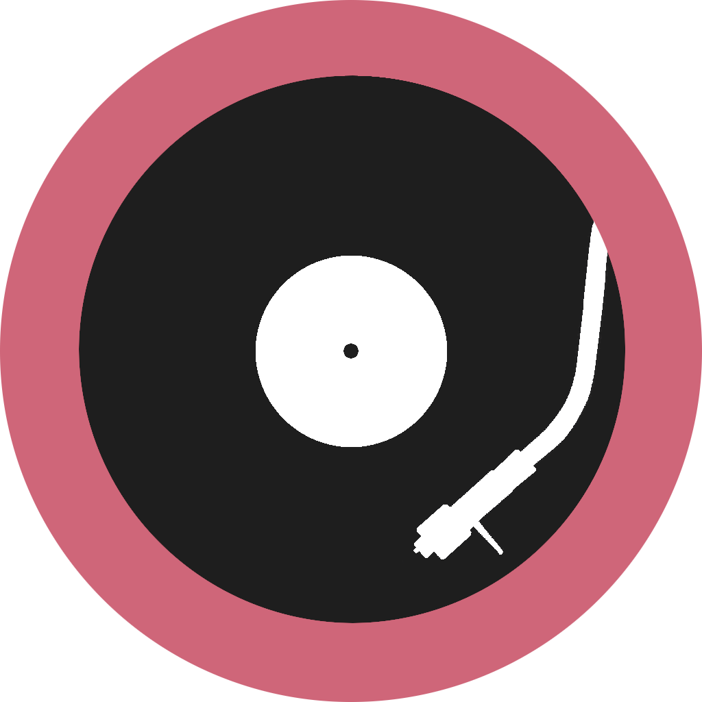
</td>
</tr>

</table>

## Index

- [Features](#features)
- [Installation](#installation)
- [How to Use](#how-to-use)
- [Technologies Used](#technologies-used)

## Features

- **Album Management**: Users can easily add and remove albums from their collection.
  
- **Custom Album**: In case the album can not be found using Last.fm API, you can add it yourself !

- **Album Information**:
  - **Album Wiki**
  - **Artist Information**
  - **Track Listing**
  
- **Search Functionality**: Users can search for specific albums or artists within the application.
  
- **Collection View Options**: Users can choose to view their albums in either list or grid format, providing flexibility in how they explore and navigate their collection.

## Installation

To use Music Collection, follow these steps:

- Clone the repository: `git clone https://github.com/JMGarCas/Music-Collection.git`

- You need a [Last.fm API](https://www.last.fm/api) key to use this application. Create inside `MusicCollection` folder a JavaScript file called `apikeys.js` and write the following code there:
  ```
  const LASTFM_API_KEY="<YOUR API KEY>";

  export default LASTFM_API_KEY;
  ```
  
- Install the required dependencies: `npm install`

- Build and run the application on your preferred mobile device or emulator: `npm run android` or `npm run ios`.

**Note**: The above installation steps assume that you have Node.js, npm, and the necessary development tools set up on your machine.

## How to Use

- The first time you open the application, you will be greeted with the following screen:

<p align="center">
  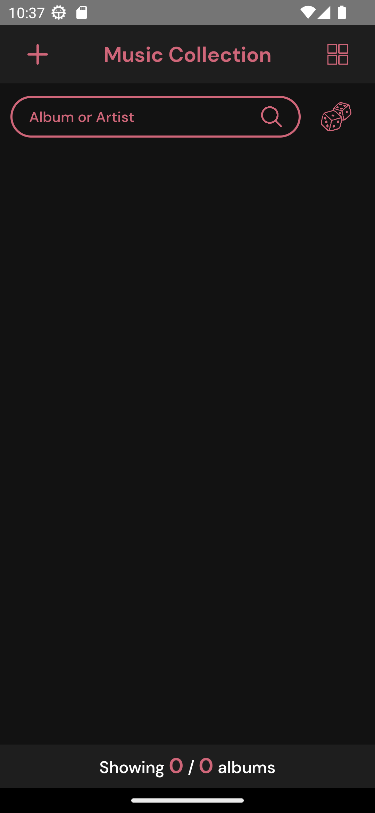
</p>

- You can add an album by clicking on the `+` button in the top-left corner. You can either add an album from the Last.fm database or create a custom album. In this step, we are going to add an album from the Last.fm database:

<p align="center">
  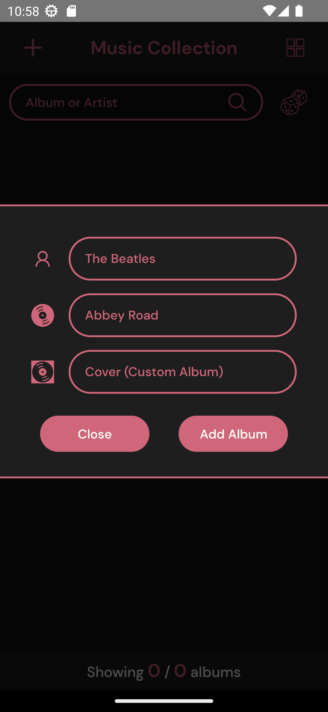
  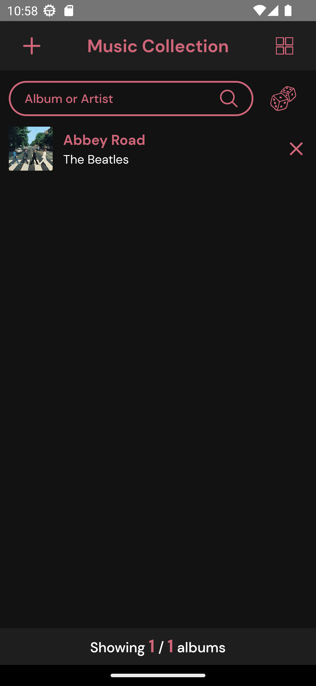 
</p>

- Once you have added an album, you can see it in your collection. Let's add a custom album. In order to add a custom album, you have to provide the URL of an image that will be the cover of the album in addition to the album name and artist:

<p align="center">
  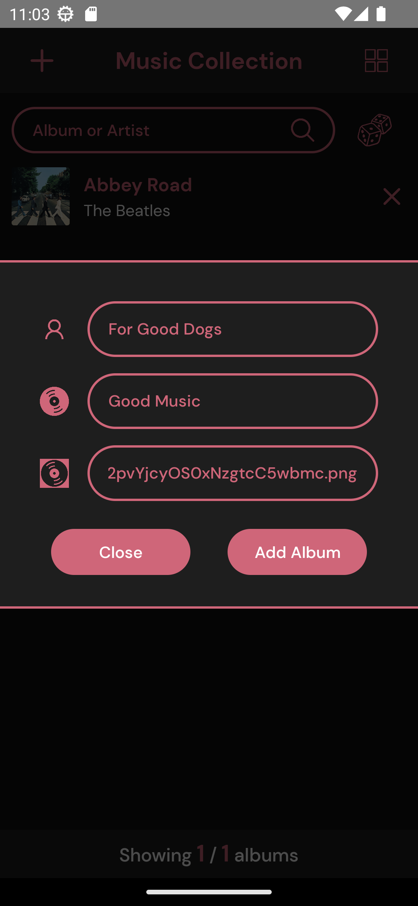
  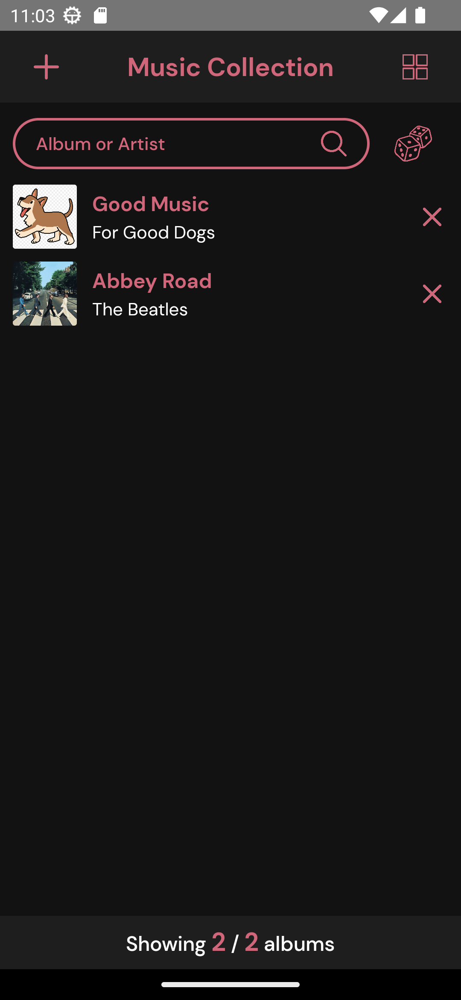
</p>

- To access information about an album, click on an album entry. You will be redirected to the following screen, which contains information about the clicked album. As you can see, there are five buttons on display. The ones at the bottom are the language selector. You can choose between English and Spanish. This selector will disappear when you scroll down. The other three buttons are used to change the information displayed.

<p align="center">
  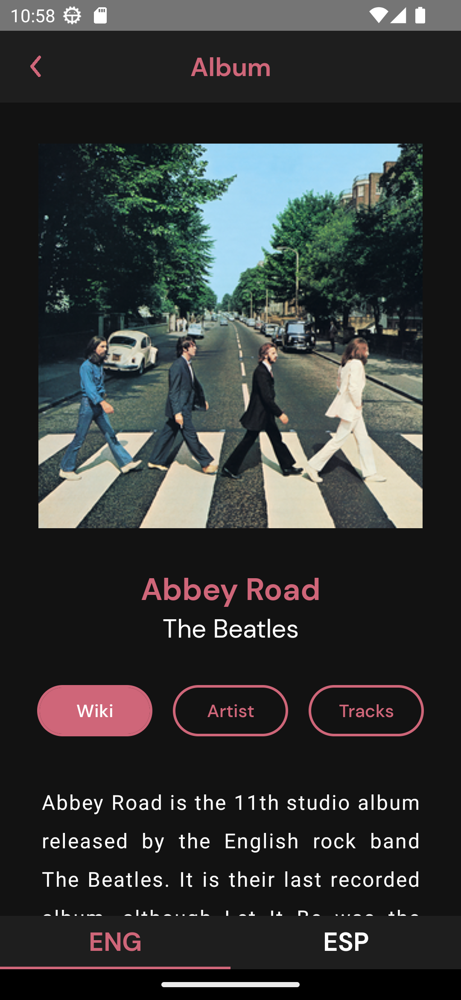
</p>

- Go back to the main screen. To delete an album, you can click on the `x` at the right of an album entry. You will be asked if you are sure you want to delete the album.

<p align="center">
  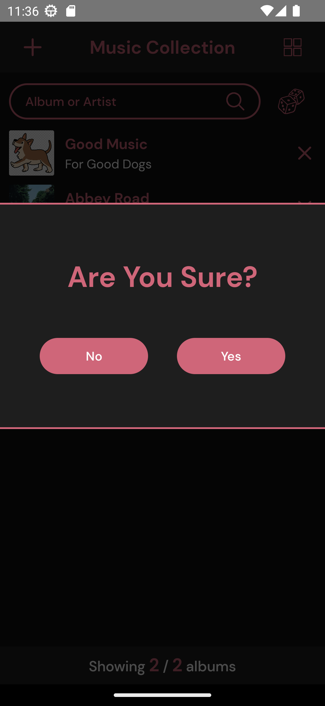
</p>

- There are two ways to display your collection, you can either display it as a list or as a grid. To change the display mode, click on the button in the top-right corner.

<p align="center">
  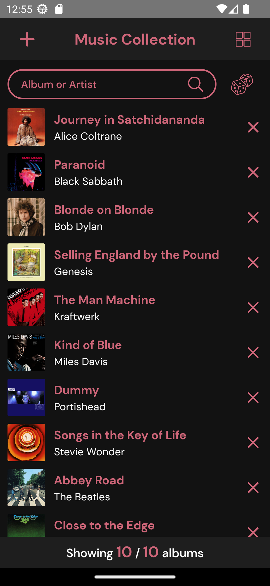
  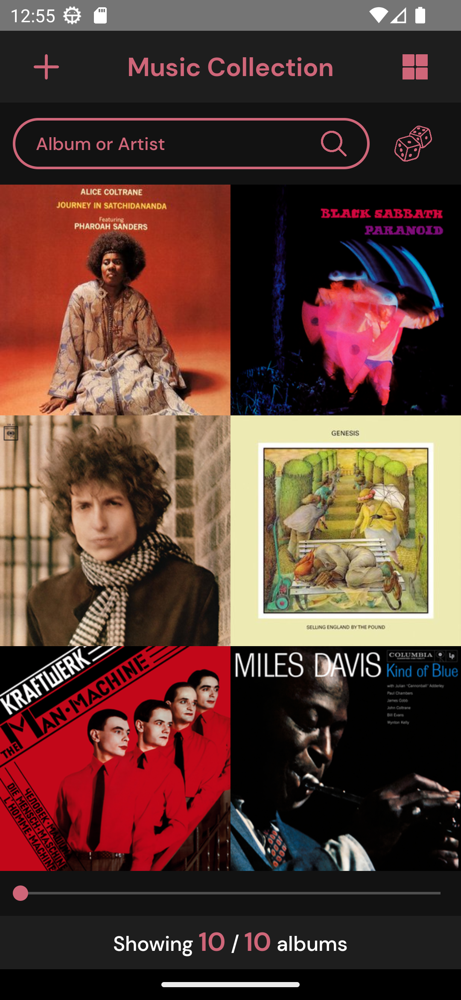
</p>

- You can use the search bar to filter the albums displayed. Those albums whose name or artist match part of the search query will be displayed. Finally, you can click on the dices button to show the information of a random album among those displayed.

<p align="center">
  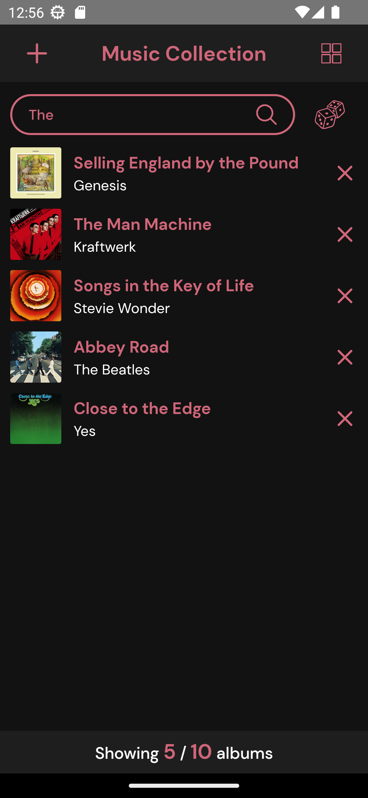
</p>

## Technologies Used

Music Collection utilizes the following technologies:

- **[React Native](https://reactnative.dev/)**: A framework for building cross-platform mobile applications using JavaScript and React.
  
- **[Last.fm API](https://www.last.fm/api)**: Provides access to a vast music database, allowing the application to retrieve detailed album information.

- **[Realm](https://realm.io/)**: A mobile database solution for storing and managing the album information locally on the device.
  
- **[Node.js](https://nodejs.org/en)**: A JavaScript runtime environment used for server-side development and dependency management.
  
- **[npm](https://www.npmjs.com/)**: Package manager for Node.js, used to install and manage project dependencies.
  
- **[Git](https://git-scm.com/)**: Version control system for tracking changes and collaborating on the project.

</div>